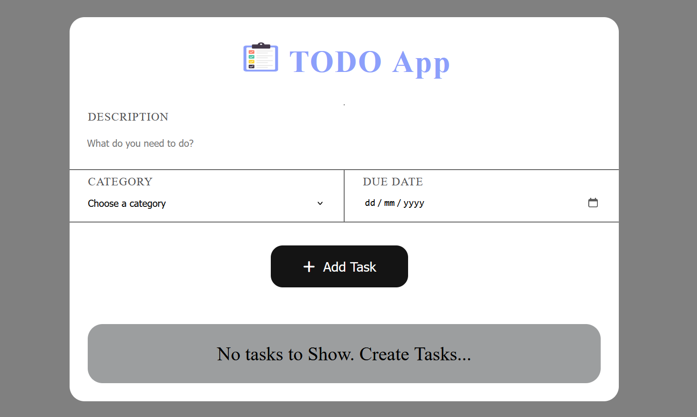
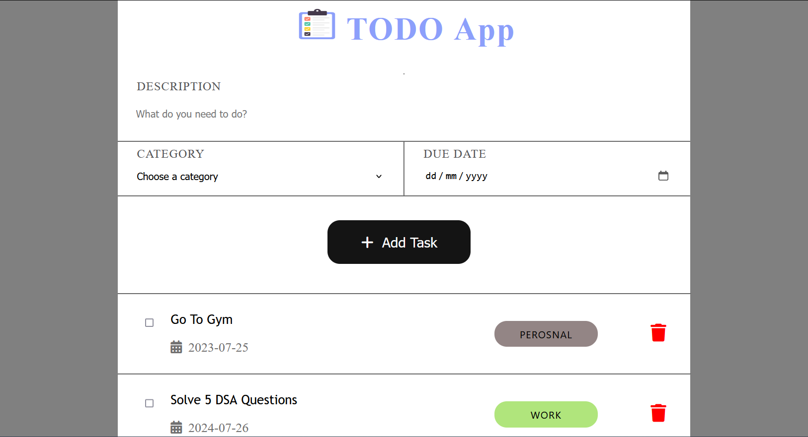

# ToDo_App

It is  Coding Ninjas Major project assignment.

## Table of contents

- [Overview](#overview)
  - [Screenshot](#screenshot)
- [My process](#my-process)
  - [Built with](#built-with)
  - [What I learned](#what-i-learned)
  - [Useful resources](#useful-resources)
- [Author](#author)
- [Acknowledgments](#acknowledgments)
- [Deploy Link](#deployed-link)

## Overview

It is a simple TODO application using NodeJS and MongDB. where a user of this application can create,edit and delete all the ToDo items .

### Screenshot

## My process

ToDo application is based on NodeJs and express as server side technology, MongoDb for Data-Base,and ejs fro front-end.  
### Built with

- HTML
- CSS
- JavaScript
- AJAX
- NodeJs
- express
- MongoDB
- ejs
### Useful resources

- [MongoDb](https://mongoosejs.com/)
- [expressJs](https://expressjs.com/)

## Author

- LinkedIn - [Mukund Jee Tiwari](https://www.linkedin.com/in/mukund-jee-tiwari/)

## Acknowledgments

This project is done by me from scratch by refering to the above websites .

<!-- ## Deployed Link -->
<!-- -[TODO APP](https://gentle-hollows-01032.herokuapp.com/) -->